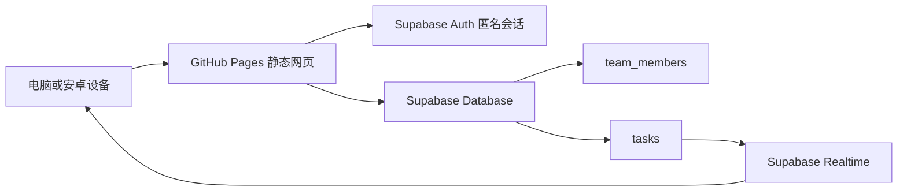

<div align="center">
  
  <h1>四象限团队任务管理系统</h1>
  <p>一款采用液态玻璃风格、支持 Supabase 实时协作的四象限任务看板。</p>

  [在线使用](https://jujube711.github.io/eisenhower-task-board/) ·
  [查看发行版本](https://github.com/Jujube711/eisenhower-task-board/releases/latest)
</div>

## 项目简介

本项目使用艾森豪威尔四象限方法管理团队任务，将任务分为：

- 重要且紧急
- 重要不紧急
- 不重要但紧急
- 不重要不紧急

网页通过 GitHub Pages 托管，团队成员和任务数据存储在 Supabase。成员加入同一个团队后，可实时看到任务的新增、编辑、完成、归档、恢复和删除。

## 主要功能

### 任务管理

- 新建、编辑、完成、归档、恢复和删除任务
- 设置任务描述、优先级、截止日期和负责人
- 完成任务后自动移入归档页面
- 支持深色模式和 JSON 数据导入、导出

### 团队协作

- Supabase 匿名安全会话
- 团队加入码验证
- 多人共享同一套任务数据
- Supabase Realtime 实时同步
- 顶部同步状态和手动刷新按钮

### 负责人视图

- 今日看板可查看全部负责人或指定负责人
- 支持“只看我的任务”
- 支持筛选未指定负责人的任务
- 归档页面按负责人分组并显示任务数量

> “只看我的任务”按照当前登录姓名与任务负责人姓名进行精确匹配。

### 移动端与 PWA

- 适配安卓手机和全面屏安全区域
- 单列移动看板和大尺寸触控按钮
- 支持安装到手机桌面
- 同一设备保留登录状态
- 设置页面显示本设备最近登录记录

## 快速使用

1. 打开[在线网站](https://jujube711.github.io/eisenhower-task-board/)。
2. 首次使用时输入姓名和团队加入码。
3. 点击“新建任务”，填写任务内容并选择象限和负责人。
4. 点击任务左侧圆圈，将任务标记完成并移入归档。
5. 在归档页面可以恢复或永久删除任务。

## 安装到安卓桌面

1. 使用 Chrome 打开在线网站。
2. 点击浏览器右上角菜单。
3. 选择“安装应用”或“添加到主屏幕”。
4. 确认安装后，即可从手机桌面启动。

如果没有看到安装选项，请刷新页面后重新打开浏览器菜单。微信、QQ 等内置浏览器可能不支持 PWA 安装。

## 技术架构



- 前端：原生 HTML、CSS、JavaScript
- 网站托管：GitHub Pages
- 身份会话：Supabase Anonymous Sign-Ins
- 数据库：Supabase PostgreSQL
- 实时同步：Supabase Realtime
- 移动安装：Web App Manifest + Service Worker

## 项目文件

```text
.
├── index.html             # 正式网页及全部前端逻辑
├── favicon.svg            # 浏览器标签图标
├── icon-192.png           # 安卓/PWA 小图标
├── icon-512.png           # 安卓/PWA 大图标
├── manifest.webmanifest   # PWA 应用配置
├── service-worker.js      # 页面与静态资源缓存
└── README.md              # 项目说明
```

## 本地运行

可以直接打开 `index.html` 查看页面。若要测试 PWA 和 Service Worker，建议在仓库目录启动本地 HTTP 服务：

```powershell
python -m http.server 8080
```

然后访问：

```text
http://localhost:8080/
```

## 部署到 GitHub Pages

1. 将修改后的文件提交到仓库 `main` 分支。
2. GitHub Pages 自动执行构建和部署。
3. 等待 Actions 中的 `pages-build-deployment` 成功完成。
4. 打开正式地址并刷新验证。

正式地址始终为：

https://jujube711.github.io/eisenhower-task-board/

## 数据说明

GitHub Pages 只保存网页、图标和 PWA 文件，不保存团队任务数据。

正式团队数据以 Supabase 为准：

- `public.team_members`：团队成员信息
- `public.tasks`：任务信息
- `public.join_team(join_code, member_name)`：团队加入验证函数

浏览器本地存储只用于缓存、主题、负责人筛选、设备标识和本设备登录记录。

## 安全说明

- 不要把 Supabase Service Role Key、数据库密码或团队加入码写入前端。
- 前端只能使用 Supabase Project URL 和 Publishable Key。
- 团队加入码应保存在数据库函数中。
- 数据访问权限依赖 Supabase Row Level Security（RLS）。
- 主动退出团队、清除浏览器数据、使用无痕模式或更换设备后，需要重新输入团队加入码。

## 当前限制

- 负责人名单目前为前端固定配置。
- 使用实时同步和团队任务需要保持网络连接。
- 本设备登录记录不会上传，也不能用于查看其他成员的登录情况。
- GitHub Pages 只适合静态前端，大型附件应存放在 Supabase Storage 或其他对象存储服务中。

## 版本

当前正式版本：[`v1.0.0`](https://github.com/Jujube711/eisenhower-task-board/releases/tag/v1.0.0)

